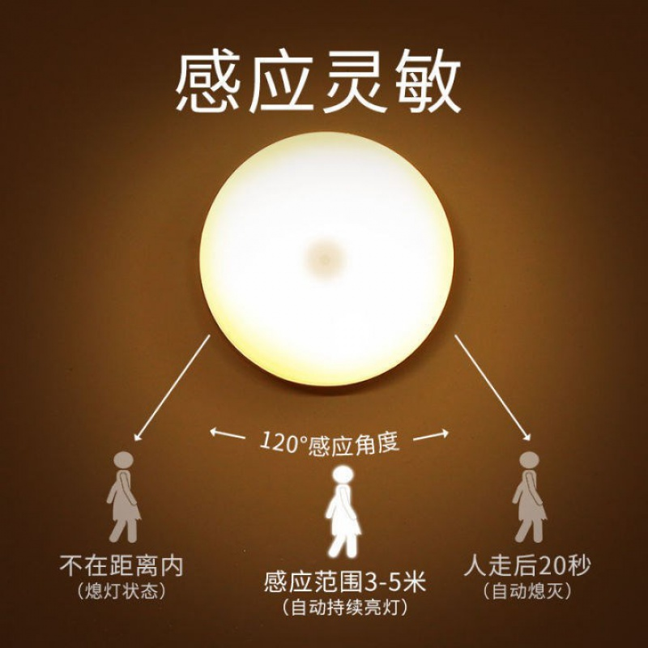

# 温湿度传感器 DHT

## 简介

温湿度传感器，检测环境温度与湿度。

## 使用场景
<figure markdown>
  { width="400" loading=lazy}
  <figcaption>声光控开关</figcaption>
</figure>
<figure markdown>
  { width="400" loading=lazy}
  <figcaption>人体感应灯</figcaption>
</figure>
<figure markdown>
  { width="400" loading=lazy}
  <figcaption>照相机</figcaption>
</figure>

## 函数

### 检测距离

#### get_intensity(port)

检测环境光亮度。<br>
*参数*：<br>
`port`，整数，端口。扩展板端口2到5分别对应端口P2到P5。</br>

*返回值*：<br>
`light_intensity`，整数。返回值的范围是0~1023。

!!! warning "注意"
    光传感器值仅反映光强的近似趋势，并不代表确切的流明。

```py title="light.py" linenums="1" hl_lines="3 9"
from tqm import serial
import time
from tqe1 import light

port = 2

while True:
    time.sleep_ms(200)
    d = light.get_intensity(port)
    serial.write_num(d)

```
