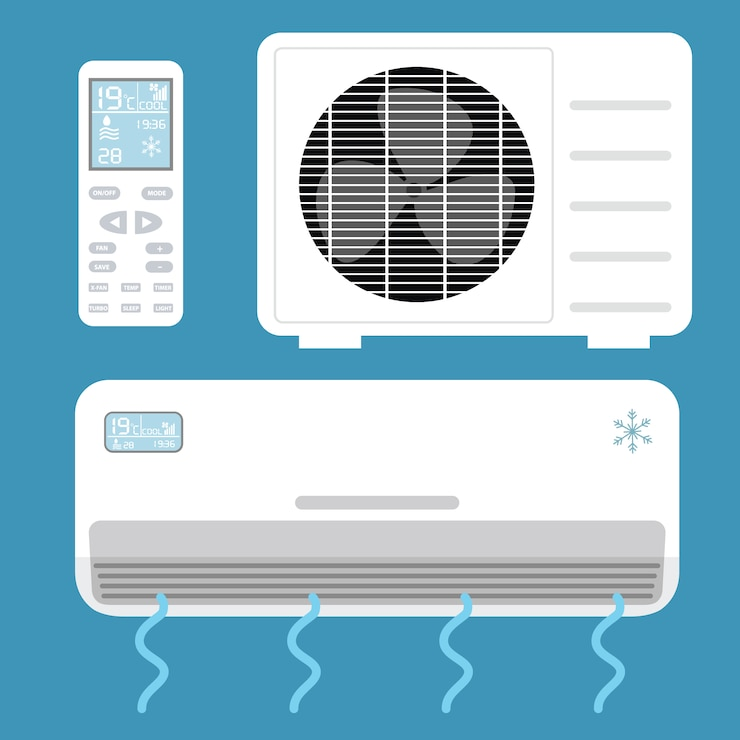
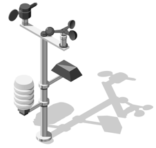

# 温湿度传感器 DHT

## 简介

温湿度传感器用于检测环境温度和湿度。采用AHT21传感器为核心。读值范围：湿度0-100%RH，温度-40~+120℃。

!!! warning "注意"
    当测量频率过高时，传感器的自身温度会升高而影响测量的精度。如果要保证它的自身温度升高低于0.1℃，建议采集数据周期大于1秒/1次。

## 使用场景
<figure markdown>
  { width="400" loading=lazy}
  <figcaption>智能空调</figcaption>
</figure>
<figure markdown>
  { width="400" loading=lazy}
  <figcaption>加湿器</figcaption>
</figure>
<figure markdown>
  { width="400" loading=lazy}
  <figcaption>气象站</figcaption>
</figure>

## 函数

### 检测温湿度

#### get_values(num)

检测温湿度。<br>
*参数*：<br>
`num` 字符串。"temperature"检测温度；"humidity"检测湿度。</br>

*返回值*：<br>
`value` 浮点数。温度返回值的范围是-40至120℃；湿度的返回值范围是0至100%。

```py title="DHTsensor.py" linenums="1" hl_lines="1 9 10"
from tqe1 import DHT
from tqm import serial
import time

humi = 0
temp = 0

while True:
  temp = DHT.get_values("temperature")
  humi = DHT.get_values("humidity")
  time.sleep(1)
  serial.write_str("温度：" + str(temp) + "℃")
  serial.write_str("湿度：" + str(humi) + "%")

```
