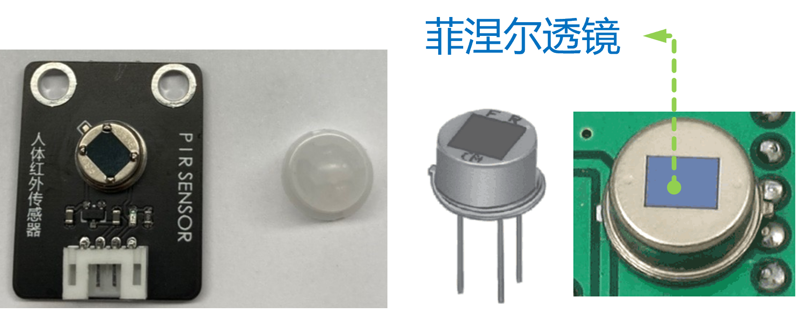
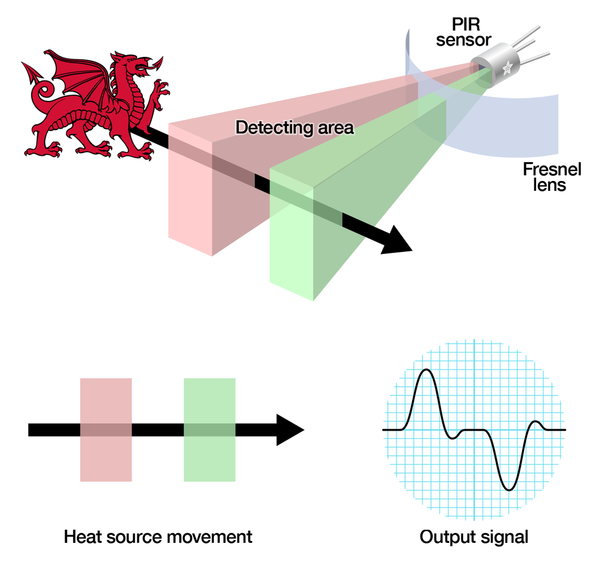
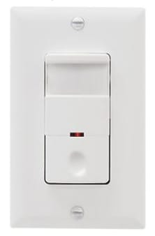

# 人体红外传感器 PIR

## 简介

人体红外传感器周围是否有人或动物移动。<br>
采用专用的红外检测头，可检测到运动的人或动物身上发出的红外线，感应距离6m左右，感应角度100°，信号输出有3秒左右的延时。

<figure markdown>
  { width="400" loading=lazy}
  <figcaption>人体红外线传感器</figcaption>
</figure>
<figure markdown>
  { width="400" loading=lazy}
  <figcaption>红外线检测物体移动原理图</figcaption>
</figure>

## 使用场景
<figure markdown>
  { width="400" loading=lazy}
  <figcaption>火焰探测器</figcaption>
</figure>
<figure markdown>
  { width="400" loading=lazy}
  <figcaption>红外灯开关</figcaption>
</figure>
<figure markdown>
  { width="400" loading=lazy}
  <figcaption>电梯</figcaption>
</figure>
<figure markdown>
  { width="400" loading=lazy}
  <figcaption>自动门</figcaption>
</figure>

## 函数

### 检测

#### get_state(port)

检测周围是否有人或动物移动。<br>
*参数*：<br>
`port`，整数，端口。扩展板端口1到5分别对应端口P1到P5。</br>

*返回值*：<br>
`state`，布尔值，状态。True检测到移动，False未检测到移动。


```py title="PIR.py" linenums="1" hl_lines="3 9"
from tqm import serial
import time
from tqe1 import PIR

port = 1

while True:
    time.sleep_ms(200)
    s = PIR.get_state(port)
    serial.write_num(s)

```
