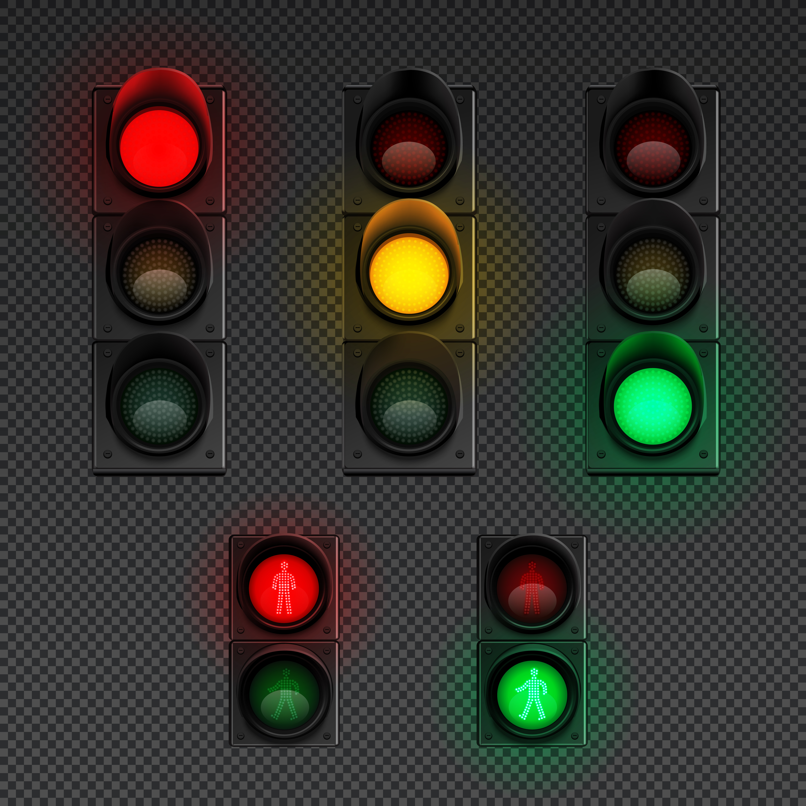

# 全彩灯 RGB

## 简介

全彩灯模块可以亮起不同颜色的灯光。<br>
采用WS2812，是一个集控制电路与发光电路于一体的智能外控LED光源。<br>
全彩灯模块可以实现多种颜色的显示。

## 使用场景

<figure markdown>
  { width="400" loading=lazy}
  <figcaption>灯带</figcaption>
</figure>
<figure markdown>
  { width="400" loading=lazy}
  <figcaption>交通灯</figcaption>
</figure>

## 函数

### 控制颜色

#### RGB.set_color(port, r, g, b, brightness)

设置全彩灯的颜色和亮度<br>
*参数*：<br>
`port`，整数，端口。扩展板端口1至5分别对应端口P1至P5<br>
`r`，整数，红色。范围是0~255<br>
`g`，整数，绿色。范围是0~255<br>
`b`，整数，蓝色。范围是0~255<br>
`brightness`，整数，亮度。亮度范围0~100

*返回值*：无。

```py
import tqm
from tqe1 import RGB

port = 5
r= 100
g = 120
b = 0
brightness = 90

RGB.set_color(port, r, g, b, brightness)

```
