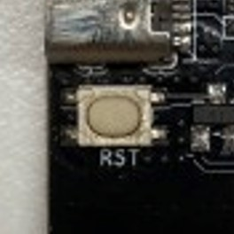

# 按钮 button （开发中……）

## 简介

按钮传感器是点动式轻触开关的数字开关模块，利用按压按钮，可以使得开关闭合和断开，输出数字开关量。

## 使用场景
<figure markdown>
  { width="400" loading=lazy}
  <figcaption>紧急停止按钮</figcaption>
</figure>
<figure markdown>
  { width="400" loading=lazy}
  <figcaption>汽车启动按钮</figcaption>
</figure>
<figure markdown>
  { width="400" loading=lazy}
  <figcaption>开发板的重置按钮</figcaption>
</figure>

## 函数

### 按下

#### is_pressed(port)

判断按钮传感器是否被按下。<br>
*参数*：<br>
`port` 整数。端口，扩展板端口1到5分别对应端口P1到P5。</br>

*返回值*：<br>
`value` 布尔值。True按下，False未按下。

```py title="pressButton&release.py" linenums="1" hl_lines="5 8"
from tqe1 import button
from tqm import *

while True:
  if button.is_pressed(3):
    display.show_icon("heart")

  while not button.is_pressed(3):
    pass
  display.show_icon("hollow heart")
```
