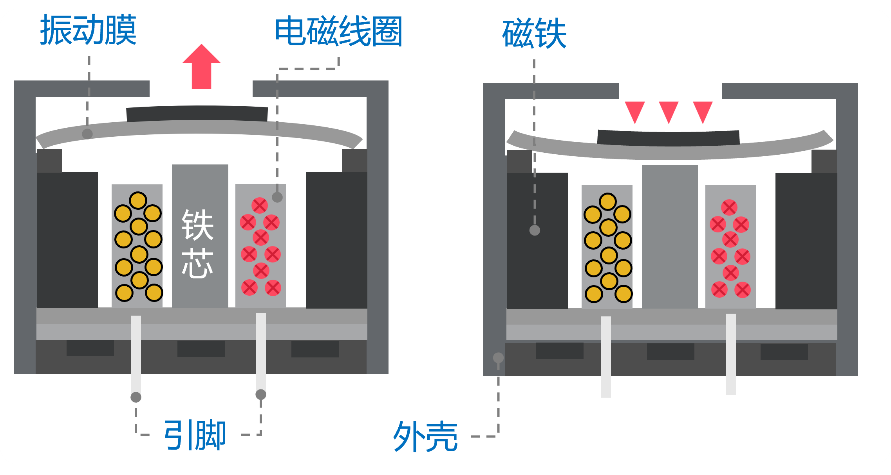
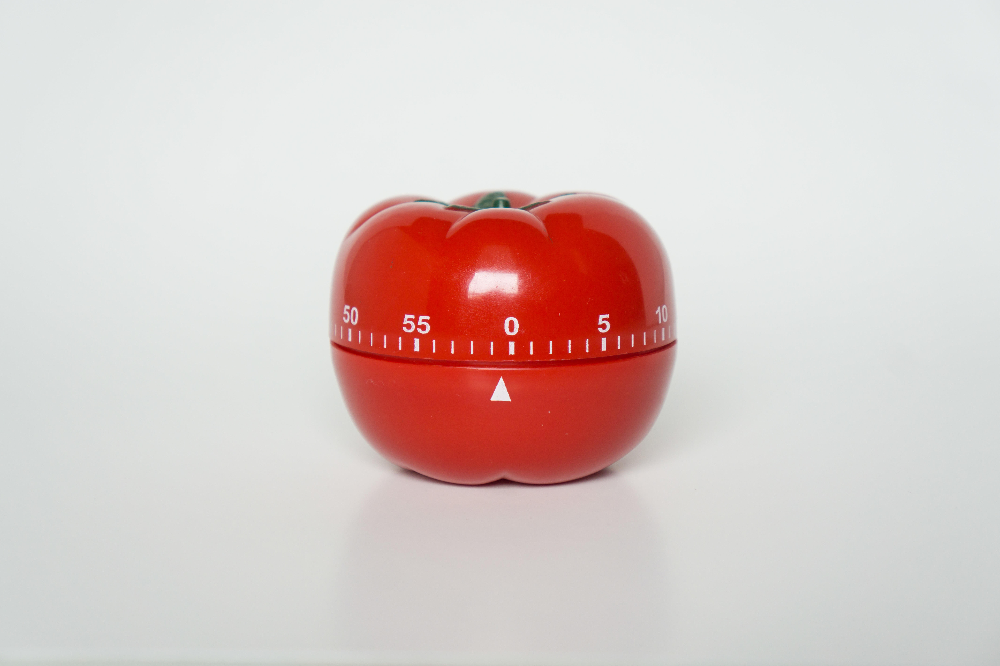
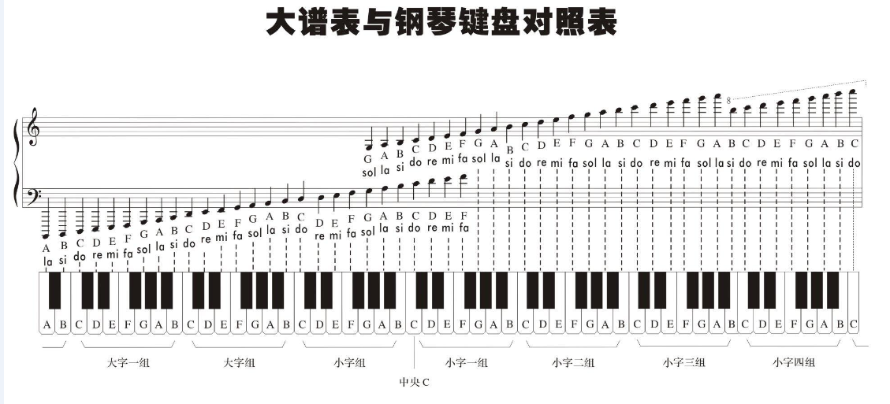
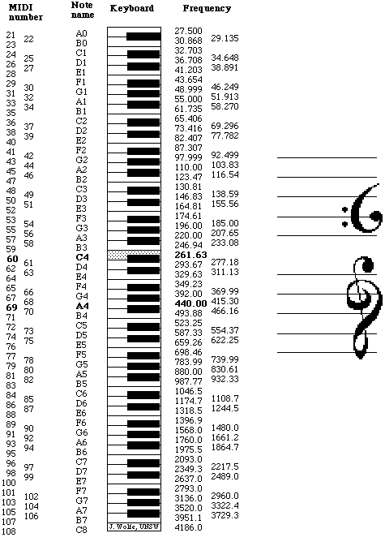

# 蜂鸣器 autodeploy

## 简介

蜂鸣器，根据输入的频率不同，产生不同的声音。可以用它做安全警报，也可以播放“蜂鸣器音乐”。<br>
工作原理是利用电磁感应现象，音频信号电流通过电磁线圈，使电磁线圈产生磁场，震动膜片在电磁线圈和磁铁的相互作用下，震动发声。

<figure markdown>
  { width="400"}
  <figcaption>无源蜂鸣器</figcaption>
</figure>

## 使用场景

<figure markdown>
  { width="400" loading=lazy}
  <figcaption>打印机提示音</figcaption>
</figure>
<figure markdown>
  { width="400" loading=lazy}
  <figcaption>烟雾报警声</figcaption>
</figure>
<figure markdown>
  { width="400" loading=lazy}
  <figcaption>定时器</figcaption>
</figure>

## 函数

### 播放音乐

#### play_music(port, num)

播放内置音乐<br>
*参数*：<br>
`port` 整数，端口。扩展板端口0, 1, 2, 3分别对应端口P0、P1、P2、P3<br>
`num` 整数，编号。编号和音乐的对应关系如下表：

| 编号  | 歌曲名  |
|:---:|:----:|
| `1` | 生日快乐 |
| `2` | 欢乐颂  |
| `3` | 葫芦娃  |
| `4` | 两只老虎 |
| `5` | 警鸣声  |

*返回值*：无。

```py
import tqm
from tqe1 import buzzer

buzzer.play_music(0, 1)
```

### 播放音符

#### play_tone(port, tone, duration)

控制蜂鸣器节拍

*参数*：  
`port` 整数，端口。扩展板端口0, 1, 2, 3分别对应端口P0、P1、P2、P3  
`tone` 字符串，音调。音调对应关系如下表：

|  编号  |  八度  |  音名  |  唱名  |  频率(赫兹)  |
|:---:|:---:|:---:|:---:|:---:|
|  `1`   |  4  |  C          |  do  |  261.63  |
|  `2`   |  4  |  C^#^/D^b^  |  di  |  277.18  |
|  `3`   |  4  |  D          |  re  |  293.66  |
|  `4`   |  4  |  D^#^/E^b^  |  ri  |  311.13  |
|  `5`   |  4  |  E          |  mi  |  329.63  |
|  `6`   |  4  |  F          |  fa  |  349.23  |
|  `7`   |  4  |  F^#^/G^b^  |  fi  |  369.99  |
|  `8`   |  4  |  G          |  so  |  392.00  |
|  `9`   |  4  |  G^#^/A^b^  |  si  |  415.30  |
|  `10`  |  4  |  A          |  la  |  440.00  |
|  `11`  |  4  |  A^#^/B^b^  |  li  |  466.16  |
|  `12`  |  4  |  B          |  ti  |  493.88  |

duration: 持续几个base（拍音调持续时间， base时间是1/4拍，125ms）

*返回值*：无。

```py
import tqm
from tqe1 import buzzer

buzzer.set_note(0, 1, 1)
buzzer.set_note(0, 2, 1)
buzzer.set_note(0, 3, 1)
```

## 参考资料
<figure markdown>
  { width="400"}
  <figcaption>大谱表与钢琴键盘对照表</figcaption>
</figure>
<figure markdown>
  { width="400"}
  <figcaption>黑白键与唱名的对照图</figcaption>
</figure>
<figure markdown>
  { width="400"}
  <figcaption>音调与频率对照表</figcaption>
</figure>
<figure markdown>
  { width="400"}
  <figcaption>国际声学音高记法</figcaption>
</figure>