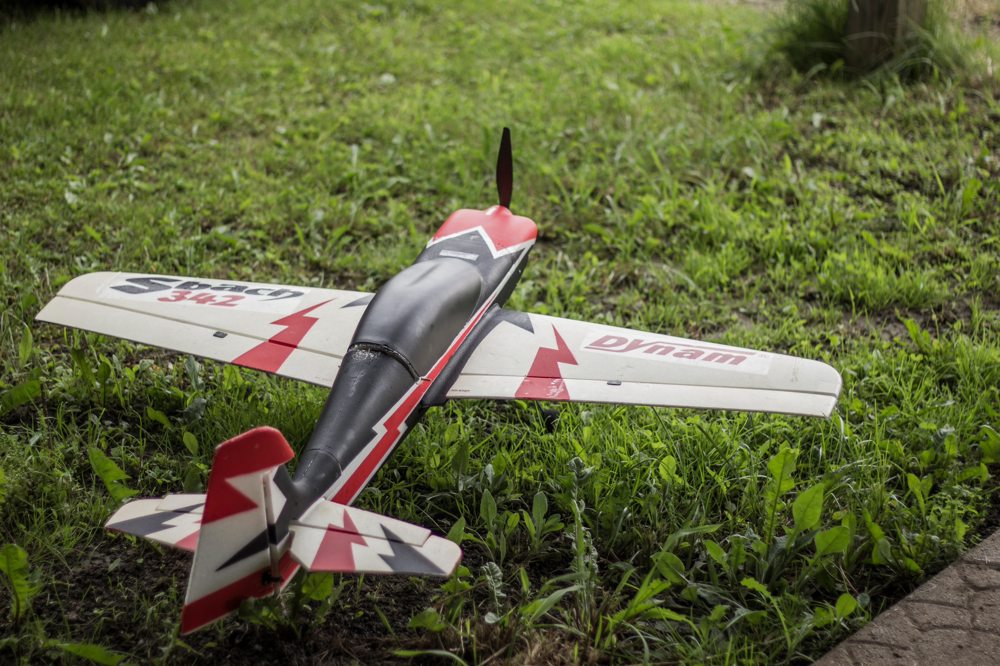

# 风扇 fan

## 简介

风扇模块。

## 使用场景

<figure markdown>
  { width="400" loading=lazy}
  <figcaption>模型飞机</figcaption>
</figure>
<figure markdown>
  { width="400" loading=lazy}
  <figcaption>智能空调</figcaption>
</figure>

## 函数

### 控制颜色

#### set_speed(port, speed)

设置全彩灯的颜色和亮度<br>
*参数*：<br>
`port` 整数。端口，扩展板端口0至3分别对应端口P0至P53。<br>
`speed` 整数。速度数值，亮度范围0~100。

*返回值*：无。

```py title="fan.py" linenums="1" hl_lines="2 8"
import tqm
from tqe1 import fan

port = 3
speed = 0

for s in range(0, 101, 1):
    fan.set_speed(port, speed)

```

