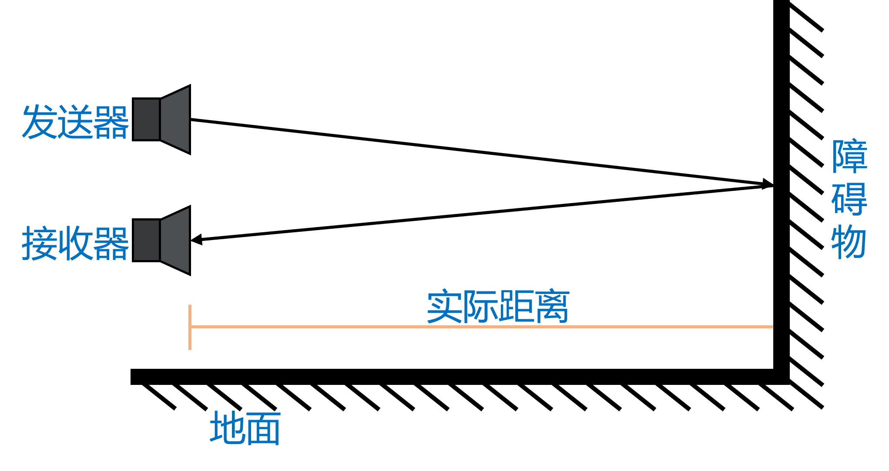

# 超声波传感器 ultrasonic

## 简介

超声波传感器，用于检测距离。
??? note "超声波测距的原理"
    该传感器有2个“眼睛”（探头），一个用于发送超声波，一个用于接收返回的超声波。<br>
    距离 = 时间间隔 × 声速 ÷ 2 （声速默认值 每秒340米）<br>

<figure markdown>
  { width="400" loading=lazy}
  <figcaption>超声波测距的原理</figcaption>
</figure>

## 使用场景
<figure markdown>
  { width="400" loading=lazy}
  <figcaption>鱼群探测器</figcaption>
</figure>
<figure markdown>
  { width="400" loading=lazy}
  <figcaption>倒车雷达</figcaption>
</figure>
<figure markdown>
  { width="400" loading=lazy}
  <figcaption>潜水艇的雷达</figcaption>
</figure>

## 函数

### 检测距离

#### get_distance(port)

检测距离。<br>
*参数*：<br>
`port` 整数。端口，扩展板端口0到3分别对应端口P0到P3。</br>

*返回值*：<br>
`distance` 整数。检测到的距离数值，单位是厘米。

!!! warning "注意"
    可测量距离范围：2~400cm，2cm内为盲区。

```py title="ultrasonicDistance.py" linenums="1" hl_lines="3 9"
from tqm import serial
import time
from tqe1 import ultrasonic

port = 3

while True:
    time.sleep_ms(200)
    d = ultrasonic.get_distance(port)
    serial.write_num(d)

```
