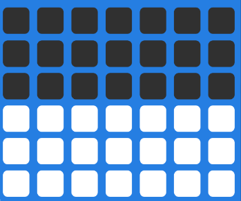

# 点阵屏 display

## 简介

控制主板的点阵屏。它可以用来显示字符串、图像甚至是动画。

## 函数

### 内置图案

#### show_icon(name)

显示内置图案。<br>
*参数*：`name` 字符串。内置图案的名称（内置图案的名称在下列代码中）。<br>
*返回值*：无。<br>

```py title="showImage.py" linenums="1" hl_lines="15"
from tqm import display
import time

# 48副内置图形 (1)
images = [
    "heart", "hollow heart", "happy", "sad", "ah", "surprised", "angry",
    "meh1", "meh2", "neutral", "up", "down", "left", "right", "U-turn",
    "yes", "no", "quarter note", "quaver", "music", "rabbit", "fox",
    "snake", "giraffe", " dog", "duck", "turtle", "muscle", "hand",
    "pointing", "telephone", "cellphone", "umbrella", "shirt", "pant",
    "mask", "skull", "robot", "sword", "right arrow", "up arrow", "fu",
    "house", "ok", "pistol", "tank", "sand clock", "trident"]

for img in images:
    display.show_icon(img)
    time.sleep_ms(300)
```

1. 内置的表情如下：<br>
   “心”、“空心”、“幸福”、“悲伤”、“啊”、“惊讶”、“愤怒”、<br>
   “meh1”、“meh2”、“中立”、“上”、“下”、“左”、“右”、 “大转变”、<br>
   “是的”、“不”、“四分音符”、“颤音”、“音乐”、“兔”, “狐狸”、<br>
   “蛇”、“长颈鹿”、“狗”、“鸭”、“龟”、“肌肉”、“手”、<br>
   “指向”、“电话”、“手机”、“保护伞”、“衬衫”、“裤”、<br>
   “面具”、“头骨”、“机器人”、“剑”、“右箭头”、“箭头”、“福”、<br>
   “房子”、“ok”、“手枪”、“坦克”、“沙漏”、“三叉戟”

### 自定义图案
#### show_leds(image)

显示自定义图案。<br>
*参数*：`image` 字符串。自定义图片的名称。<br>
*返回值*：无。<br>

```py title="showDIYImage.py" linenums="1" hl_lines="4"
from tqm import display

# 参数：1点亮，0熄灭；字符串和点阵的对应关系，从上往下，从左往右。
image1 = "1000100,0000000,0010000,0000000,1000100,0000001"
display.show_leds(image1)
```

### 滚动显示数据

#### scroll(value)

滚动显示指定的内容。<br>
*参数*：`value` 字符串/整数/浮点数/布尔值。要显示的内容。<br>
*返回值*：无。<br>

```py title="scroll.py" linenums="1" hl_lines="4"
from tqm import display

value = "hello world！"
display.scroll(value)
```

### 调整亮度（开发中……）

#### set_brightness(number)

设置点阵屏亮度。<br>
*参数*：`number` 整数。亮度范围0~10，默认值5。<br>
*返回值*：无。<br>

```py title="setBrightness.py" linenums="1" hl_lines="3"
from tqm import display

display.set_brightness(10)
```

### 熄灭屏幕

#### clear()

熄灭屏幕。<br>
*参数*：无。<br>
*返回值*：无。<br>

```py title="clear.py" linenums="1" hl_lines="5"
from tqm import display

value = "I will disappear later."
display.scroll(value)
display.clear()
```

### 柱状图
#### bar_graph()

绘制条形图（分子除以分母，得到的数值在0~1之间时，会在主板的点阵屏上绘制柱状图，数值越接近1，屏幕电亮的灯越多，比如分子是5，分母是10，5/10=0.5，点阵屏会点亮一半）。<br>

<figure markdown>
  { width="400"}
  <figcaption>柱状图</figcaption>
</figure>

*参数*：<br>
`value` 整数。分子。<br>
`high` 整数。分母。<br>
*返回值*：无。<br>

```py title="display_bar_graph.py" linenums="1" hl_lines="7"
from tqm import display

i = 0
while True:
  time.sleep_ms(50)
  i = i + 1
  display.bar_graph(i, 100)
  serial.write_num(i)
  if i > 100:
    i = 0
```

### 点亮/熄灭坐标点（开发中……）
#### set_pixel()

点亮/熄灭坐标点。<br>

*参数*：<br>
`x` 整数。横坐标0~6。<br>
`y` 整数。纵坐标0~5。<br>
`value` 整数。默认1，1是点亮，0是熄灭。<br>
*返回值*：无。<br>

```py title="display_pixels.py" linenums="1" hl_lines="9 12"
from tqm import display

x = 0
y = 0
while True:
  x = math.random(0, 6)
  y = math.random(0, 5)
  
  display.set_pixel(x, y, 1)
  time.sleep_ms(300)
  
  display.set_pixel(x, y, 0)
  time.sleep_ms(300)
```
